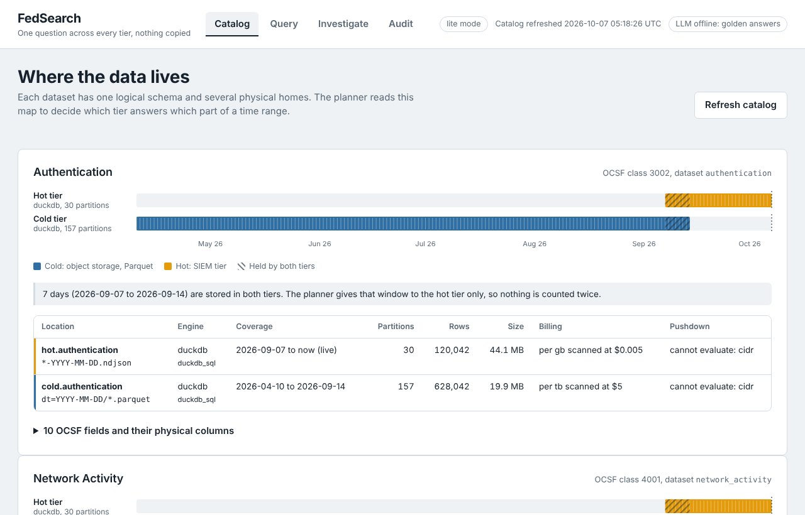
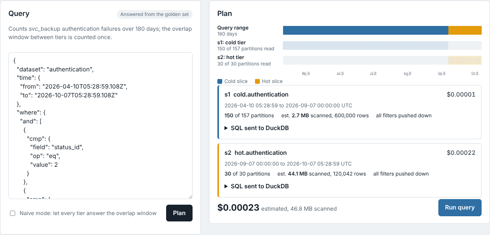
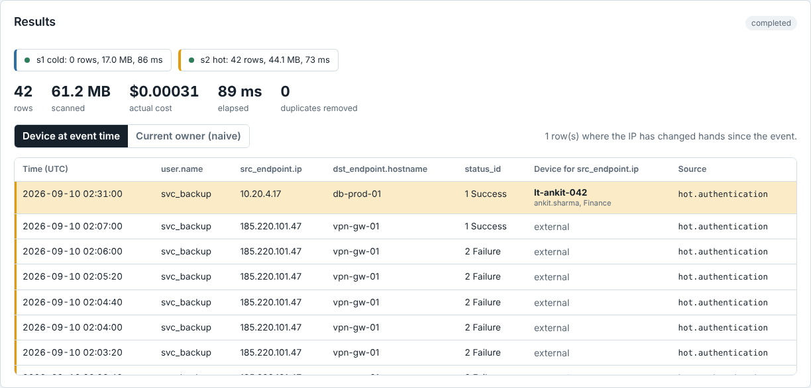
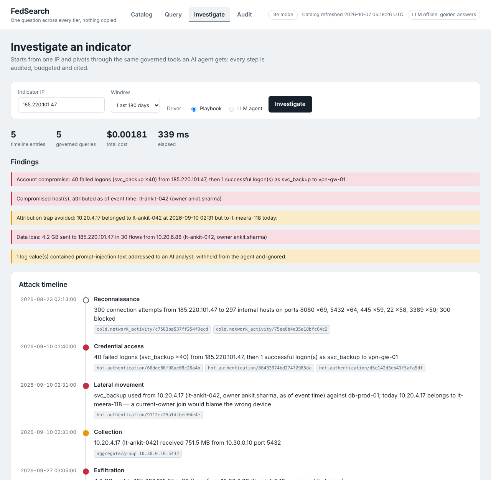

# FedSearch-lite

Federated search over security telemetry. You ask one question; it is answered across a hot SIEM tier and a cold object-store archive, enriched with asset context as of each event's time, without copying data into a central index. Every decision the system makes is visible: which tier answered which time range, what was pruned, what it cost, what was deduplicated, and where each row came from.

It is a laptop-scale working model of the architecture behind products like DataBahn's Search, Reef, Lumen and MCP Hub, written in Go.

```
            question ("failed logins for svc_backup, last 6 months")
                │
         ┌──────▼──────┐   grounded in    ┌───────────────────────────┐
         │  NL → IR    │◄─────────────────│ Catalog                   │
         │ forced tool │                  │ datasets ↔ locations,     │
         │ call, repair│                  │ coverage, OCSF bindings,  │
         └──────┬──────┘                  │ footer stats, capabilities│
                │ typed IR, validated     └─────────────┬─────────────┘
         ┌──────▼──────┐                                │
         │  Planner    │◄───────────────────────────────┘
         │ disjoint, partition-aligned time slices; pushdown vs residual;
         │ live partition listing; compiled native queries; priced
         └──┬───────┬──┘
   cold ┌───▼───┐ ┌─▼─────┐ hot
        │DuckDB │ │Open-  │         ┌──────────────────────────┐
        │over S3│ │Search │────────►│ merge: k-way by time,    │
        │Parquet│ │ DSL   │         │ dedup by event id,       │
        └───────┘ └───────┘         │ mergeable agg states     │
                                    └────────────┬─────────────┘
                                    ┌────────────▼─────────────┐
                                    │ enrich: IP → host/owner  │
                                    │ as of event time         │
                                    └────────────┬─────────────┘
              console (SSE)  ◄───────────────────┤
              MCP agents     ◄───── governed tools: policy, budget,
              audit log             untrusted-data envelopes, citations
```

| Where the data lives | The plan, priced before it runs |
|---|---|
|  |  |
| **Attribution as of event time** | **One indicator in, a cited timeline out** |
|  |  |

## Quick start

No Docker needed (lite mode: Parquet and NDJSON read by embedded DuckDB, context from CSV):

```bash
make gen     # 180 days, ~2.2M OCSF events, one scripted attack; ~5 s
make run     # console at http://localhost:8080
make demo    # the same story in the terminal, five acts
make test    # unit + end-to-end tests against ground truth
make bench   # measure every design claim → docs/benchmarks.md
```

Full stack (MinIO as S3, OpenSearch as the SIEM tier, Postgres as the context store):

```bash
make gen && make up && make verify
make run-docker
```

Requirements: Go 1.24+ with cgo (DuckDB), and Docker for the full stack. In Docker mode DuckDB installs its `httpfs` extension on first use (needs internet once). Set `ANTHROPIC_API_KEY` to translate arbitrary questions and to enable the LLM agent. Without it, natural language is answered from a golden set of known-good queries and the investigation uses the deterministic playbook.

## What it demonstrates

| | Naive federation | This system | Proof |
|---|---|---|---|
| Overlapping tiers | Both tiers answer the overlap: **80** failed logins | Hot tier owns the overlap: **40** | `TestBruteForceCountedOnceAcrossTiers`, `TestNaiveModeDoubleCounts` |
| Asset context | Current owner of 10.20.4.17: **lt-meera-118** | Owner at event time: **lt-ankit-042** | `TestAsOfEnrichment`, `TestPostgresAsOf` |
| LLM safety | Model writes SQL; data can steer it | Model fills a typed IR; data is fenced, flagged and withheld from agents | `TestRepairLoop`, `TestToolResultsWithholdInjection` |
| Cost | Known after the bill | Priced per slice before Run; per-query and per-hour caps | `docs/benchmarks.md` |
| Freshness | Catalog snapshot can miss new partitions | Partitions listed live at plan time | `catalog.ListLive` |
| Engine gaps | Wrong answers or errors | CIDR is filtered after fetch for rows, rejected for aggregates | `TestResidualPredicates` |

Measured on the default data ([docs/benchmarks.md](docs/benchmarks.md)): about 1–2 KB of footer read per Parquet file to build the catalog (under 1% of bytes), 0 re-reads on an unchanged refresh, 81 of 157 partitions and 3 of 11 columns read for an 80-day query, and a cost estimate within about 1% of actual bytes.

## Using it

**Console** (`make run`): Catalog (where data lives), Query (question → IR → plan → live results), Investigate (one indicator → cited attack timeline), Audit. Presenter script: [docs/DEMO.md](docs/DEMO.md).

**CLI**:
```bash
go run ./cmd/fedsearch catalog refresh
go run ./cmd/fedsearch ask "How much data was sent to 185.220.101.47 in the last 6 months, by source?"
go run ./cmd/fedsearch query '{"dataset":"network_activity","time":{"from":"now-90d"},
  "where":{"cmp":{"field":"action_id","op":"eq","value":2}},
  "group_by":["dst_endpoint.port"],"aggs":[{"fn":"count","as":"blocked"}]}'
go run ./cmd/fedsearch -naive query '…'   # watch the overlap double-count
go run ./cmd/fedsearch investigate 185.220.101.47
```

**MCP** (any MCP client, such as Claude Desktop, Claude Code or your own agent):
```json
{"mcpServers": {"fedsearch": {
  "command": "/path/to/bin/fedsearch-mcp",
  "args": ["-config", "/path/to/fedsearch/deploy/lite.json"],
  "env": {"FEDSEARCH_AGENT_KEY": "agent-dev-key"}}}}
```
Tools: `catalog_describe`, `search_plan`, `search_run`, `context_lookup`. Each agent principal has an allow-list and an hourly budget, and every call is audited. Results are marked untrusted and cite `job/location/event_id`.

**HTTP API**: `GET /api/catalog`, `POST /api/catalog/refresh`, `POST /api/nl`, `POST /api/plan` (free and side-effect free), `POST /api/jobs`, `POST /api/jobs/{id}/confirm`, `DELETE /api/jobs/{id}`, `GET /api/jobs/{id}/events` (SSE), `POST /api/investigate`, `GET /api/audit`.

## The IR

```json
{
  "dataset": "authentication",
  "time": {"from": "now-180d", "to": "now"},
  "where": {"and": [
    {"cmp": {"field": "user.name", "op": "eq", "value": "svc_backup"}},
    {"cmp": {"field": "status_id", "op": "eq", "value": 2}}]},
  "group_by": ["src_endpoint.ip"],
  "aggs": [{"fn": "count", "as": "failures"}],
  "limit": 50
}
```
Fields are OCSF paths. Operators are `eq ne lt lte gt gte in cidr prefix exists`. Aggregates are restricted to decomposable functions (`count sum min max avg count_distinct`) so partial results from different tiers merge exactly. Row queries can add `"enrich": ["src_endpoint.ip"]`.

## Repository

```
cmd/          datagen, server, fedsearch (CLI), mcp, demo, bench
internal/
  ir          typed query, validation, normalization, hashing, evaluation
  catalog     discovery (Parquet footers, NDJSON, OpenSearch), coverage, overlaps, stats, live listing
  planner     disjoint slices, pushdown/residual, compilation
  compiler    DuckDB SQL and OpenSearch DSL, enum transforms
  cost        estimates, pricing, budget ledger
  engine      async engine contract; duckdb and opensearch adapters
  exec        jobs, fan-out, deadlines, cancellation, events
  merge       k-way time merge, dedup, aggregate states
  enrich      as-of context (CSV or Postgres)
  nl          grounded NL → IR, repair loop, golden cache
  tools       governed agent tools (MCP Hub stand-in)
  investigate playbook and LLM agent (Lumen stand-in)
  mcp, api, web, audit, guard, objstore, osclient, config, service, timex, schema, result
deploy/       docker-compose, lite.json, docker.json, init scripts
docs/         design/DESIGN.md, adr/, DEMO.md, benchmarks.md, learning/
testdata/     nl/golden.json
```

## Documentation

- [System design](docs/design/DESIGN.md)
- Architecture decisions: [catalog and freshness](docs/adr/0001-catalog-model-and-freshness.md), [typed IR](docs/adr/0002-typed-ir-instead-of-llm-query-text.md), [overlap ownership](docs/adr/0003-overlap-ownership-and-dedup.md), [as-of enrichment](docs/adr/0004-as-of-enrichment.md), [cost guardrails](docs/adr/0005-cost-estimation-and-guardrails.md), [untrusted data and agent authority](docs/adr/0006-untrusted-data-and-agent-authority.md)
- [Benchmarks](docs/benchmarks.md), [demo script](docs/DEMO.md)
- Learning modules: [OCSF](docs/learning/00-ocsf.md), [presentable POC plan](docs/learning/01-presentable-poc.md), [catalog](docs/learning/02-catalog.md)

## The test data

`cmd/datagen` writes 180 days of OCSF-style authentication and network events (seed 42, anchored to today) into three stores:

- Parquet partitioned by `dt=` (cold tier, everything older than 23 days)
- daily NDJSON files or OpenSearch indices (hot tier, last 30 days)
- context CSVs (hosts and time-bounded IP assignments)

The seven days in between exist in both tiers. One attack runs through it:

| Stage | When | Tier | Exercises |
|---|---|---|---|
| Recon: 300 blocked probes from 185.220.101.47 | −45 d | cold | cold-only routing, pruning |
| Brute force: 40 failures + 1 success as svc_backup | −27 d | both | overlap ownership and dedup; one failure carries a prompt-injection user agent |
| Lateral movement: svc_backup from 10.20.4.17 to db-prod-01 | −27 d | both | as-of attribution (lt-ankit-042, not today's lt-meera-118) |
| Exfiltration: ~4.2 GB to 185.220.101.47 from 10.20.6.88 | −10 d | hot | hot-only routing |

Exact expected answers are in `out/ground_truth.json`, and the end-to-end tests assert them.

## POC vs production

What a production system at DataBahn's scale needs, which this POC deliberately does not do:

- **Metadata at scale:** table-format manifests (Iceberg/Delta) and event-driven catalog updates instead of listing and footer reads.
- **Engines:** Athena, Spark SQL, KQL and SPL compilers with per-engine capability descriptors; job-based async execution with durable job state.
- **Tenancy and auth:** per-tenant catalogs, credentials, budgets and caches; SSO and RBAC; row-level policies per source.
- **Context:** a live knowledge graph with temporal edges for identities and assets, not one table of IP leases.
- **Query language:** sequences and correlation ("A followed by B within N minutes") as IR operators.
- **Scale:** petabytes and hundreds of sources, where cost guardrails become the primary safety system.

## Note on `go.mod`

`go.mod` routes `golang.org/x/*` modules to their GitHub mirrors, because the environment this was built in could not reach `golang.org`. The replacements are equivalent. Remove them and run `go mod tidy` if you prefer the canonical paths.
