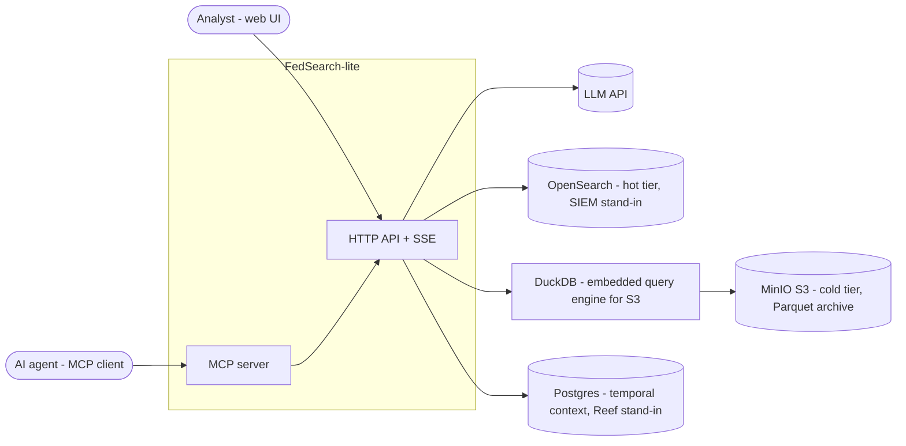
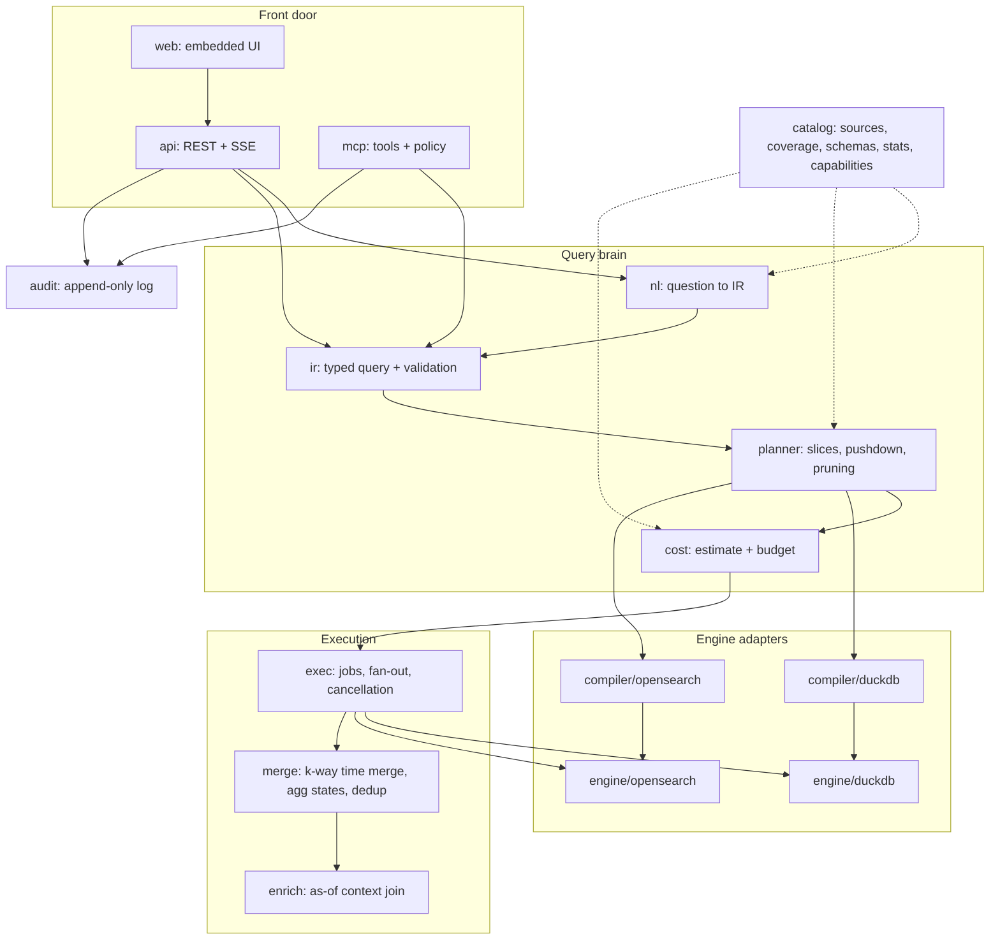
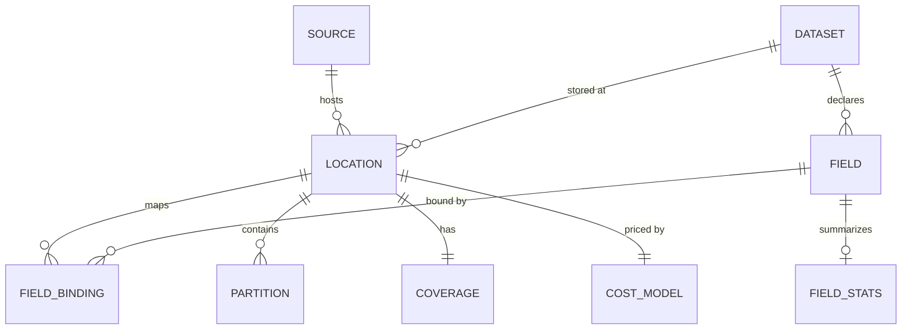
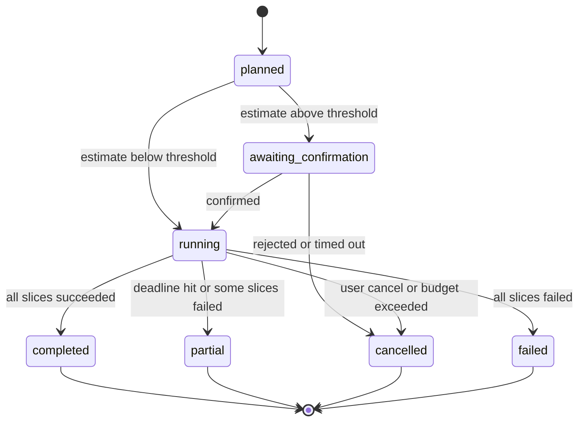
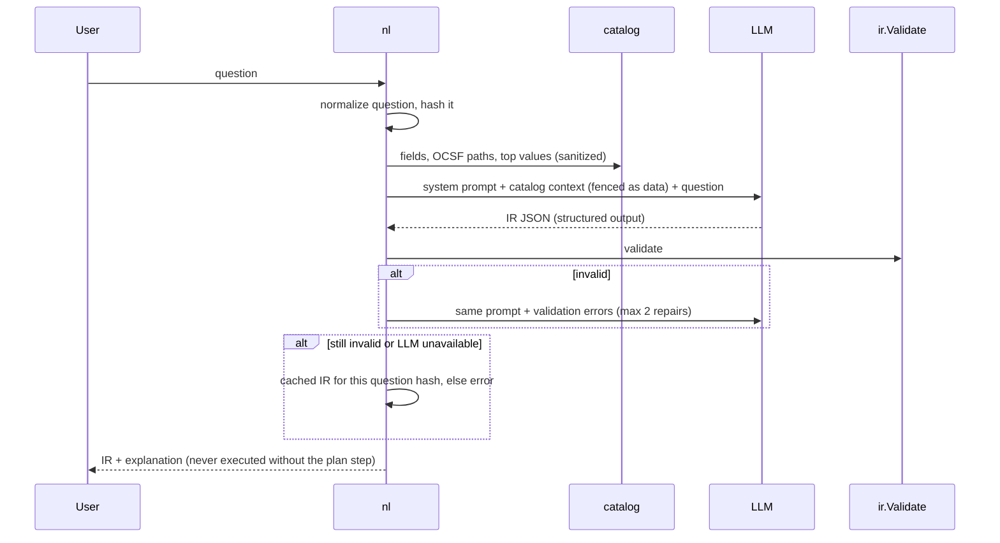

# FedSearch-lite: System Design

| | |
|---|---|
| **Status** | Accepted for POC |
| **Author** | RK |
| **Scope** | Laptop-scale POC of federated search over security telemetry, modeled on DataBahn's Search / Reef / Lumen / MCP Hub |
| **Audience** | Engineers reviewing the design; DataBahn federated search team |

---

## 1. Problem and goals

Security telemetry for one organization is split across a hot SIEM tier (fast, expensive, short retention), a cold object-store archive (cheap, slow, long retention) and context systems (asset and identity inventories). Each speaks a different query language. Investigations that span tiers take hours, and naive tooling gives answers that are **silently wrong**: double-counted overlap, missed partitions, or events attributed to the wrong host.

### Goals

| # | Goal | Measured by |
|---|---|---|
| G1 | One question, answered across every tier, with no data copied into a central index | The demo query returns all 4 attack stages from 2 engines |
| G2 | **Correct by construction**: no double counting, no silent gaps, time-correct attribution | Ground-truth tests pass: exact counts, as-of host attribution |
| G3 | Cost is known before execution and enforced during it | Estimate error ≤ 25% vs actual bytes scanned; hard budget cap |
| G4 | Natural-language access that is safe and grounded | ≥ 90% exact-IR match on the golden question set; zero raw LLM text executed |
| G5 | Agents get the same governed access as analysts | Every agent query audited; injection content flagged, never obeyed |
| G6 | Every decision is visible: plan, pruning, cost, dedup, provenance | All surfaced in the API and UI |

### Non-goals (deliberately out of scope)

- Production scale (billions of rows), high availability, multi-region deployment.
- Multi-tenancy and real authentication. A single static tenant and an API key are enough.
- Full OCSF coverage. Two classes only: Authentication (3002) and Network Activity (4001).
- Arbitrary joins across datasets. The only join is enrichment with context.
- Write paths. The system is strictly read-only against every store.

### Non-functional targets (laptop, default data volume of ~2.2M events)

| Metric | Target |
|---|---|
| Plan + estimate latency | < 300 ms |
| Hot-tier query p95 | < 1 s |
| 6-month cold scan with pruning | < 15 s |
| Time to first results for a cross-tier query | < 1.5 s (hot results stream first) |
| Footer bytes read per Parquet file | < 16 KB |
| Catalog refresh with no changes | 0 footer reads |

---

## 2. System context



**Why DuckDB is embedded rather than a server:** it plays Athena's role (SQL over Parquet in S3, with partition and row-group pruning) without a cluster. It runs in-process through `go-duckdb` and reads MinIO through its `httpfs` S3 support.

---

## 3. Architecture



### Component responsibilities

| Package | Owns | Does not own |
|---|---|---|
| `catalog` | Logical datasets, physical locations, coverage, field bindings to OCSF, statistics, capabilities, sanitized samples | Executing queries |
| `ir` | The query language: types, validation, canonical JSON, normalization | Knowing any engine exists |
| `nl` | Turning a question into IR, grounded in the catalog; repair loop; cached fallback | Running anything |
| `planner` | Logical plan → physical plans: time slicing across locations, overlap ownership, pushdown vs residual, live partition listing | Cost policy |
| `cost` | Estimating bytes and money per physical plan; enforcing budgets | Planning |
| `compiler/*` | Physical plan → native query text (DuckDB SQL, OpenSearch DSL). Pure functions. | Network I/O |
| `engine/*` | Submit / poll / fetch / cancel against one store; byte accounting | Merging |
| `exec` | Job lifecycle, fan-out, deadlines, cancellation, per-engine concurrency limits, streaming | Result semantics |
| `merge` | Time-ordered k-way merge, dedup by event identity, aggregate state merging | Fetching |
| `enrich` | As-of joins against the context store; batching and caching | Choosing what to enrich |
| `api`, `web` | REST, SSE, embedded UI | Business logic |
| `mcp` | Tool surface for agents, per-caller budgets, audit, untrusted-content labeling | Bypassing any of the above |
| `audit` | Append-only JSONL record of every query, by whom, cost and outcome | — |

### Dependency rule

Dependencies point inward only. `ir` is a leaf. `catalog` depends only on storage clients. `planner` depends on `ir` and `catalog`. Compilers depend on `ir` and the planner's plan types. `exec` depends on the `engine.Engine` interface, never on concrete adapters. Adapters are wired together in `cmd/server`. This keeps every core package unit-testable without Docker.

```
cmd/server ──► api, mcp, web
api, mcp   ──► nl, planner, cost, exec, enrich, audit
nl         ──► ir, catalog
planner    ──► ir, catalog
cost       ──► planner, catalog
exec       ──► engine (interface), merge
engine/*   ──► compiler/*, catalog
compiler/* ──► ir, planner (types only)
```

---

## 4. Domain model: the catalog

**Central idea: one logical dataset, many physical locations.** A location holds a copy of a dataset for a time coverage window, inside one engine, with its own field names and capabilities.



```go
package catalog

// Dataset is a logical OCSF class, independent of where it lives.
type Dataset struct {
    Name     string  // "authentication"
    ClassUID int     // 3002
    Fields   []Field // canonical fields, keyed by OCSF path
}

type Field struct {
    Path  string     // OCSF path: "src_endpoint.ip"
    Type  FieldType  // string | int | long | ip | timestamp | keyword
    Role  FieldRole  // event_time | event_id | dimension | measure | free_text
    Stats FieldStats
}

// Location: one physical copy of a dataset.
type Location struct {
    ID         string     // "cold.s3.authentication"
    Dataset    string
    Source     SourceRef  // engine kind + connection reference (never secrets)
    Layout     Layout     // s3 prefix + partition scheme, or index pattern
    Coverage   Coverage
    Bindings   map[string]FieldBinding // OCSF path -> physical
    Unmapped   []PhysicalField
    Caps       Capabilities
    Cost       CostModel
    Partitions []Partition // cold: one per dt=; hot: one per daily index
    SchemaVer  int         // bumps on drift
}

type Coverage struct {
    From, To   time.Time // half-open [From, To)
    Complete   bool      // false if the newest partition may still be filling
    Freshness  time.Time // when coverage was last verified
    Granularity time.Duration // partition width, used to align time slices
}

type FieldBinding struct {
    Physical   string      // "src_endpoint_ip"
    PhysType   FieldType
    Transform  *Transform  // e.g. enum map "failure" -> status_id 2
    Provenance string      // declared | inferred | ai_suggested
    Searchable, Aggregatable bool // from _field_caps / engine type
}

type Partition struct {
    Key        string    // "dt=2026-09-10" or "ocsf-authentication-2026.09.10"
    Span       [2]time.Time
    Rows       int64
    Bytes      int64
    ColumnBytes map[string]int64 // compressed bytes per column (cold, from footers)
    ETag       string    // cache key for footer reads
}

type FieldStats struct {
    Cardinality uint64   // HLL estimate
    TopValues   []string // only when low-cardinality
    Examples    []Sample // high-cardinality: sanitized, truncated
    NullFrac    float64
}

type Sample struct {
    Value     string // truncated to 64 chars, control chars stripped
    Suspicious bool  // matched injection heuristics; never shown to the LLM
}
```

### Discovery strategies

| Source | Coverage from | Schema from | Stats from | Capabilities from |
|---|---|---|---|---|
| S3 Parquet | `dt=` partition names, cross-checked with footer min/max of `time` | Parquet footer | Footer: rows, column chunk sizes, min/max | Static: SQL engine, full pushdown |
| OpenSearch | Daily index names, refined with a min/max agg on `time` | `_mapping` | `_cat/indices`, terms aggs on low-cardinality fields | `_field_caps`: searchable / aggregatable per field |
| Postgres | n/a | `information_schema` | n/a | Static |

Rules:
- **Footer reads** use an `io.ReaderAt` over S3 ranged GETs: one read of the last 8 bytes, then one read of the footer. Results are cached keyed by `(object key, ETag)`, so an unchanged refresh performs zero reads.
- **Drift**: the catalog compares each partition's schema with the location's schema. A new column is added with `NULL` for older partitions. A type change widens the location type (`int → string`) and bumps `SchemaVer`. The compiler then casts per partition (§6.4).
- **Coverage truth**: partition names say *where to look*; footer min/max says *what is actually there*. When they disagree (for example, a late-arriving event written to the next day's partition), coverage uses the wider span, and the planner always applies a residual time filter.

### Freshness decision

The catalog is a **planning hint, not the source of truth for which partitions exist.** At plan time, the planner lists partitions live for the requested time range in the cold tier (one `ListObjectsV2` per day prefix, bounded to the query range) and resolves index patterns live in the hot tier. A partition written after the last catalog refresh is therefore never missed. Its stats are simply estimated from neighboring partitions until the next refresh.

*Worst case:* a cost estimate that's too low for a brand-new partition. That is acceptable. A missed partition is not, because in security "no results" reads as "no attack."

---

## 5. The IR (intermediate representation)

The IR is the contract between the NL layer, the API, MCP and the engines. **No engine ever receives text an LLM wrote.**

```go
package ir

type Query struct {
    Version   int         `json:"v"`             // 1
    Dataset   string      `json:"dataset"`       // logical dataset
    Time      TimeRange   `json:"time"`          // REQUIRED, half-open [from, to)
    Where     *Expr       `json:"where,omitempty"`
    Select    []string    `json:"select,omitempty"`   // OCSF paths, row queries
    GroupBy   []string    `json:"group_by,omitempty"`
    Aggs      []Agg       `json:"aggs,omitempty"`
    Having    *Expr       `json:"having,omitempty"`   // over agg aliases only
    Order     Order       `json:"order,omitempty"`    // rows: time asc|desc
    Limit     int         `json:"limit"`
    Enrich    []string    `json:"enrich,omitempty"`   // OCSF paths holding IPs
}

type TimeRange struct{ From, To time.Time }

// Expr is a boolean tree. Exactly one of the branches is set.
type Expr struct {
    And []*Expr `json:"and,omitempty"`
    Or  []*Expr `json:"or,omitempty"`
    Not *Expr   `json:"not,omitempty"`
    Cmp *Cmp    `json:"cmp,omitempty"`
}

type Cmp struct {
    Field string `json:"field"` // OCSF path
    Op    Op     `json:"op"`    // eq ne lt lte gt gte in cidr prefix exists
    Value any    `json:"value"`
}

type Agg struct {
    Fn    AggFn  `json:"fn"`    // count | sum | min | max | avg | count_distinct
    Field string `json:"field,omitempty"`
    As    string `json:"as"`
}
```

### Validation rules (enforced before planning, for every caller)

1. `dataset` exists in the catalog. Every field path is bound in at least one location.
2. `time` is present, `from < to`, and the span is ≤ 365 days.
3. Each operator is type-compatible: `cidr` only on `ip`, `lt`/`gt` only on ordered types, and `in` takes at most 1,000 values.
4. Row queries need `limit` ≤ 10,000. Aggregate queries need `group_by` cardinality guarded by `limit` ≤ 1,000.
5. **Only decomposable aggregates**: count, sum, min, max, avg (carried as sum and count) and count_distinct (carried as an HLL sketch, so the result is approximate and labeled as such).
6. Expression depth ≤ 8 and node count ≤ 64. This bounds what an LLM can generate.
7. `enrich` paths must have type `ip`.

**Canonical form:** the IR is normalized (sorted `and`/`or` children, lowercased enums, UTC times) and hashed. The hash keys the result cache, the cached NL fallback, and the audit record.

---

## 6. Planning

### 6.1 Time slicing and overlap ownership

Given the query range `[F, T)` and the dataset's locations sorted by preference (hot first), the planner assigns **disjoint time slices**:

```
query:      F |-----------------------------------------------| T
cold:         |==========================|                       coverage [Apr 10, Sep 14)
hot:                              |=============================| coverage [Sep 7, now)
assigned:     |---- cold slice ----|------- hot slice -----------|
                                   ^ split = hot.From aligned UP to cold partition granularity
```

Algorithm:

1. Intersect `[F, T)` with each location's coverage.
2. Walk locations by preference. The **hot tier owns the overlap**: it's faster, and the cold copy of that window adds nothing.
3. Each less-preferred location receives only the remainder that more-preferred locations don't cover. The split point is **aligned to partition boundaries** (UTC day), so the cold tier reads whole partitions and never half a day.
4. Any part of `[F, T)` that no location covers becomes a `CoverageGap` and is **reported to the user**, never silently dropped.

**Why disjoint slices are mandatory, not an optimization:** dedup by `event_id` works for rows but cannot work for aggregates. A `count` from the hot tier and a `count` from the cold tier can't be deduplicated after the fact. Only disjoint slices make merged aggregates exact. Row dedup (§8.2) stays in as defense in depth, and its counter makes any violation of the disjointness invariant visible.

### 6.2 Pushdown vs residual

For each slice, every predicate is classified against the location's capabilities:
- **Pushdown**: the engine can evaluate it on the bound physical field. Example: `term` on a searchable keyword field.
- **Residual**: the engine can't, or the field needs a transform the engine can't express. The executor evaluates it after fetching.

A residual predicate on a row query means over-fetching. The planner multiplies the engine-side limit by a safety factor and flags the plan as `may_truncate`. A residual predicate on an aggregate query is **rejected**, because it would produce wrong numbers.

### 6.3 Partition and column pruning

- **Cold:** list the `dt=` prefixes within the slice, then select only the columns referenced by `select`, `where`, `group_by` and `aggs`, plus `time` and `event_id`. DuckDB adds row-group pruning on `time` min/max, which works because the files are time-sorted.
- **Hot:** resolve daily index names within the slice instead of querying `ocsf-*`.

### 6.4 Schema drift in compilation

When a location's `SchemaVer` shows a type change, the compiler emits a cast to the widened type (`CAST(dst_endpoint_port AS VARCHAR)`), using DuckDB's `union_by_name` for Parquet files whose schemas differ.

### 6.5 Physical plan

```go
package planner

type Plan struct {
    QueryHash string
    Slices    []Slice
    Gaps      []ir.TimeRange
    Warnings  []string // may_truncate, approximate_distinct, stale_stats
}

type Slice struct {
    Location   string
    Time       ir.TimeRange
    Partitions []string     // resolved live
    Columns    []string     // physical names after pruning
    Pushed     *ir.Expr
    Residual   *ir.Expr
    Native     string       // compiled query, shown in the UI
    Estimate   cost.Estimate
}
```

---

## 7. Cost model and guardrails

Each location declares its own cost model, which mirrors how real backends bill:

| Location | Model | Estimate formula |
|---|---|---|
| Cold (Athena-like) | `per_tb_scanned`, default $5/TB | Σ over pruned partitions of Σ selected columns' compressed bytes (from footers) |
| Hot (SIEM-like) | `per_gb_scanned`, configurable (some SIEM log tiers bill per GB queried) | Matching doc count from `_count` with the pushed filter × average doc size per index |
| Context | `free` | — |

**Guardrails**, applied in order:
1. **Estimate before execution.** The plan response always includes per-slice and total estimates.
2. **Confirm threshold.** Above $0.01 (configurable), the job waits in `awaiting_confirmation` until the caller confirms.
3. **Hard cap per query** ($1 default) and a **rolling per-caller budget** ($5/hour). These are enforced at submit time and checked again while running against actual bytes reported by engines. When crossed, the job is cancelled and the engines' native cancel APIs are called.
4. **Accounting.** Actual bytes are recorded per slice in the audit log. Estimate error is a tracked benchmark metric.

---

## 8. Execution

### 8.1 Job lifecycle



`partial` is a first-class outcome. The response names exactly which slices are missing and why.

### 8.2 Engine contract

```go
package engine

type Engine interface {
    Kind() string
    Submit(ctx context.Context, s planner.Slice) (Handle, error)
    Poll(ctx context.Context, h Handle) (Status, error)        // queued|running|done|failed + bytes so far
    Fetch(ctx context.Context, h Handle, cursor string) (Page, error)
    Cancel(ctx context.Context, h Handle) error
}

type Page struct {
    Rows     []Row          // already mapped back to OCSF paths, time-sorted
    Partials []agg.State    // for aggregate queries
    Next     string         // empty = exhausted
    Bytes    int64          // bytes scanned so far, for budget checks
}
```

The interface is async even though DuckDB is synchronous. The DuckDB adapter runs the query in a goroutine behind a handle, so the executor treats a local engine and a remote job-based engine (Athena, SIEM search APIs) identically.

### 8.3 Fan-out

- One goroutine per slice, under the job's context. Each slice gets its own deadline: hot 5 s, cold 60 s.
- **Per-engine semaphores** cap concurrency (DuckDB 2, OpenSearch 4), so one heavy query can't starve the others.
- Cancellation propagates in both directions. Context cancellation calls `Engine.Cancel`, and a budget breach cancels the job's context.
- Results flow through bounded channels. A slow consumer applies backpressure to fetching instead of growing memory.

### 8.4 Merge

**Row queries: k-way merge.** Each slice yields time-sorted pages. A min-heap keyed by `(time, event_id)` emits globally ordered rows. **Dedup is O(1) memory per timestamp:** because duplicates share an identical `time` and the merge is time-ordered, duplicates arrive adjacent. A seen-set covering only the current timestamp is enough, cleared whenever `time` advances. Dropped duplicates increment a counter that is returned in the response.

**Aggregate queries: mergeable states.**

| Function | Partial state | Merge |
|---|---|---|
| count, sum | int64 / float64 | add |
| min, max | value | min / max |
| avg | (sum, count) | add both, divide at the end |
| count_distinct | HLL sketch (precision 14) | union registers; result labeled approximate |

**Group-by with limit across slices:** each slice returns *all* groups up to a cap of 10× the limit. The merged top-N is then exact unless a cap was hit, in which case the result carries a `may_be_inexact` warning (the same trade-off OpenSearch's `shard_size` makes).

### 8.5 Streaming to clients

Results are delivered through Server-Sent Events: one-way server→client, plain HTTP, simple to proxy, and auto-reconnect is built in. The event types are:

| Event | Payload |
|---|---|
| `plan` | Slices, native queries, estimates, gaps, warnings |
| `slice` | Status change for one slice: running / done / failed, rows, bytes, latency |
| `rows` | A batch of merged, enriched rows (≤ 500) |
| `agg` | Current merged aggregate result (updated as slices finish) |
| `stats` | Dedup count, total bytes, elapsed |
| `done` | Final status: completed / partial / cancelled, and the reason |

Rows from the hot tier appear in about a second while the cold scan is still running. This is the fix for the latency gap between tiers.

---

## 9. Enrichment (Reef stand-in)

Each enriched IP is joined with context **as of the event's timestamp**:

```sql
SELECT a.ip, a.validity, h.hostname, h.owner, h.department, h.criticality
FROM ip_assignments a JOIN hosts h USING (hostname)
WHERE a.ip = ANY($1)                -- distinct IPs in this batch
  AND a.validity && tstzrange($2, $3)  -- batch time span
```

- **Batching:** for each `rows` batch, collect the distinct IPs and the batch time span, then make one query. Matching each row to its interval happens in memory, so there are no per-row round trips.
- **Caching:** an LRU cache of interval lists per IP. Intervals are immutable once closed, so caching is safe. Only open-ended intervals expire (TTL 5 minutes).
- **Modes:** `as_of` (correct, the default) and `current`, which exists only so the demo can show the wrong answer side by side.
- **Integrity:** the context store rejects overlapping assignments with a GiST exclusion constraint, so a lookup returns at most one host per IP and time.

---

## 10. Natural-language layer



- **Grounding:** the prompt includes only catalog facts: dataset names, OCSF paths, types, and top values of low-cardinality fields. Suspicious samples are excluded entirely.
- **Structured output:** the LLM must return IR JSON matching the schema. Free text is ignored.
- **Relative time** ("last 6 months") is resolved by the LLM against a `now` the server injects into the prompt. The validator then checks that the span is plausible.
- **Determinism for demos and tests:** temperature 0, plus a cache of known-good IR keyed by the normalized question hash. The golden question set (≈ 20 questions with expected IR) serves as the regression suite and the demo fallback.

---

## 11. Agent access (MCP Hub stand-in)

### Tools

| Tool | Purpose | Guardrail |
|---|---|---|
| `catalog_describe` | Datasets, fields, coverage | Sanitized samples only |
| `search_plan` | IR → plan + estimate | Validation |
| `search_run` | Execute a planned query | Per-agent budget; confirmation is auto-denied above the threshold for agents |
| `context_lookup` | As-of host for IP + time | Rate limit |

### Policy layer (applies to every tool call)

1. **Identity:** each MCP client presents an API key that maps to a principal with a budget and an allowed-tool list.
2. **Audit:** each call writes a JSONL record with principal, tool, IR hash, slices, bytes, cost, outcome and latency.
3. **Untrusted content labeling:** tool results wrap data rows in an envelope marked `"trust": "untrusted_data"`. String fields matching injection heuristics (imperatives addressed to an AI, "ignore previous instructions", role markers) are **flagged and truncated in the agent-facing copy**, and the flag is surfaced in the UI. The original value stays available to human analysts.
4. **Citations:** every row carries `{job_id, location, event_id}`. Agent output must cite these refs; the investigation view renders them as clickable provenance.

**Principle:** the agent's *authority* comes only from the policy layer. Nothing in the data can grant or change it. Flagging injected text is defense in depth, not the primary control.

---

## 12. API

| Method | Path | Purpose |
|---|---|---|
| GET | `/api/catalog` | Datasets, locations, coverage, fields |
| POST | `/api/catalog/refresh` | Trigger discovery |
| POST | `/api/nl` | Question → IR + explanation |
| POST | `/api/plan` | IR → plan + estimates |
| POST | `/api/jobs` | Submit a plan → job ID (may enter `awaiting_confirmation`) |
| POST | `/api/jobs/{id}/confirm` | Confirm above-threshold cost |
| DELETE | `/api/jobs/{id}` | Cancel |
| GET | `/api/jobs/{id}/events` | SSE stream (§8.5) |
| GET | `/api/audit` | Recent audit records |

`/api/plan` is deliberately separate from `/api/jobs`. Planning is free and side-effect free, so the UI can show cost before anything runs.

---

## 13. User interface

Served by the Go binary via `go:embed`, with no frontend build. Vanilla JS plus a small charting library loaded from a CDN.

| Screen | Driven by | Shows |
|---|---|---|
| Catalog | `GET /api/catalog` | Datasets × locations, coverage timeline with the overlap highlighted, fields with OCSF paths, capability badges |
| Query | `/api/nl`, `/api/plan` | Question box → IR panel → plan panel: slice timeline, partitions pruned / total, native query per slice, cost → Run |
| Results | SSE | Rows arriving live, slice status chips, dedup counter, enrichment column with an as-of / current toggle, provenance on hover |
| Investigation | MCP audit + results | Agent timeline with citations; injection banner |

---

## 14. Observability

- **Tracing (OpenTelemetry):** one trace per job, with spans for `nl`, `plan`, each `slice` (attributes: location, partitions, bytes, rows), `merge` and `enrich`. Exported to stdout, or to Jaeger when one is configured.
- **Metrics:** slice latency histogram by location, bytes scanned, estimate error ratio, dedup count, NL repair count, budget denials.
- **Logs:** `log/slog` JSON, correlated by job ID and trace ID.

---

## 15. Failure modes

| Failure | Behavior | Visible as |
|---|---|---|
| Cold tier slow | Hot rows stream first; cold arrives later or hits its deadline | `slice` events; final status `partial` if the deadline passes |
| One engine down | Other slices complete | `partial` with a reason per slice; never an empty "success" |
| Partition appears after catalog refresh | Live listing at plan time includes it | Stats warning `stale_stats` |
| Time range not covered by any location | Reported, not dropped | `gaps` in the plan |
| Overlap invariant violated (bug or boundary drift) | Row dedup removes duplicates | Non-zero dedup counter |
| Residual predicate on an aggregate | Rejected at plan time | Validation error |
| Cost above the cap | Rejected at submit, or cancelled mid-run | `cancelled: budget_exceeded` |
| LLM returns invalid IR | Repair up to 2×, then cached fallback, else error | `nl` response includes repair attempts |
| Injection text in results | Flagged and truncated for agents | Banner in the investigation view |
| Context store down | Rows delivered unenriched | Enrichment column shows "unavailable" |

---

## 16. Testing strategy

| Layer | Approach |
|---|---|
| `ir` | Table tests for validation; property test that normalize(normalize(q)) = normalize(q) |
| Compilers | Golden files: IR in → expected SQL / DSL out |
| Planner | Synthetic catalogs: slices are disjoint, slices cover the range exactly, gaps are reported, splits are aligned |
| Merge | Property test: splitting any dataset into arbitrary disjoint time slices and merging equals the single-source answer, for rows and every aggregate |
| End to end | Against the Docker stack, asserting exact numbers from `ground_truth.json`: 40 brute-force failures, 300 recon probes, 30 exfil flows, as-of host `lt-ankit-042` |
| NL | Golden question set: exact match on normalized IR |
| Security | The planted injection string never reaches the LLM verbatim; agent budget denials; audit completeness |

---

## 17. Repository layout

```
fedsearch/
  cmd/
    datagen/   server/   bench/   mcp/
  internal/
    ir/  catalog/  nl/  planner/  cost/
    compiler/{duckdb,opensearch}/  engine/{duckdb,opensearch}/
    exec/  merge/  enrich/  audit/  api/  mcp/
    web/       (embedded UI assets)
  deploy/      docker-compose + init scripts
  docs/
    design/DESIGN.md   adr/   learning/   benchmarks.md
  testdata/
    golden/{ir,sql,dsl}/   nl_questions.yaml
```

---

## 18. POC vs production

| Concern | POC | Production (DataBahn scale) |
|---|---|---|
| Cold-tier metadata | Footer reads with an ETag cache | Table formats (Iceberg/Delta manifests) where available; event-driven catalog updates |
| Query engine | Embedded DuckDB | Athena, Spark SQL and SIEM-native APIs, with job-based async execution |
| Job state | In memory | Durable store, so a restart never orphans a running scan |
| Tenancy | Single tenant | Per-tenant catalogs, credentials, budgets and cache isolation |
| Auth | API key | SSO, RBAC, row-level policies per source |
| Dialects | DuckDB SQL, OpenSearch DSL | KQL, SPL, SQL variants, each with capability descriptors |
| Context | Postgres temporal tables | Live knowledge graph with temporal edges |
| Scale | ~2M events | Petabytes; cost guardrails become the main safety system |

---

## 19. Delivery plan

| Milestone | Scope | Exit criteria |
|---|---|---|
| M1 | Data fixture + stack | ✅ Done |
| M2 | Catalog | Coverage and overlap detected; footer-only reads; zero reads when unchanged |
| M3 | IR + validation | Golden validation tests; golden NL question set written |
| M4 | DuckDB compiler + engine | Pruning visible; recon count = 300 |
| M5 | OpenSearch compiler + engine | Exfil count = 30 |
| M6 | Planner + cost | Disjoint aligned slices; estimate within 25% |
| M7 | Executor | Streaming; cancellation reaches engines; partial results |
| M8 | Merge | Brute-force failures = 40 across tiers; property tests pass |
| M9 | Enrichment | Lateral movement → `lt-ankit-042` (as-of) vs `lt-meera-118` (current) |
| M10 | NL | ≥ 90% golden set; cached fallback |
| M11 | MCP + audit | Agent investigation with citations; injection flagged |
| M12 | API + UI | All five demo acts clickable |
| M13 | Demo, benchmarks, README | `make demo` idempotent; `docs/benchmarks.md` published |
